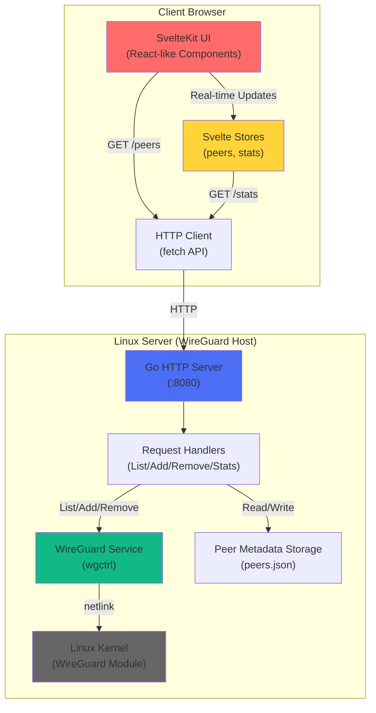
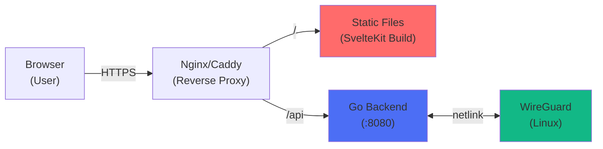

# System Architecture

**Last Updated**: 2026-01-31

## High-Level Overview

WireGuard Manager is a **full-stack VPN peer management system** consisting of:

1. **Frontend** (SvelteKit + TypeScript + TailwindCSS) — User-facing dashboard for managing WireGuard peers
2. **Backend** (Go + net/http) — REST API exposing WireGuard interface control

The system manages **WireGuard interface configuration** (adding/removing peers) and provides **real-time statistics** on peer connectivity and data transfer.

## System Diagram



## Major Components & Responsibilities

### Frontend (Svelte/SvelteKit)

**Purpose**: User interface for managing WireGuard peers

**Key files**:

- **Routes** (`src/routes/`):
  - `+page.svelte` — Dashboard showing overall stats
  - `peers/+page.svelte` — Peer list with add/remove buttons
  - `stats/+page.svelte` — Detailed statistics view
  - `+layout.svelte` — Navigation bar (top-level layout)

- **Components** (`src/lib/components/`):
  - `PeerTable.svelte` — Table rendering peer list
  - `PeerModal.svelte` — Modal dialog for adding peers
  - `QRCodeDisplay.svelte` — QR code display (for peer config sharing)
  - `StatusBadge.svelte` — Online/offline indicator
  - `Notification.svelte` — Toast notifications

- **State Management** (`src/lib/stores/`):
  - `peers.ts` — Peer list, add/remove operations, API integration
  - `stats.ts` — Statistics fetching and caching

**Data types** (`src/lib/types.ts`):

- `Peer` interface (matches backend response)

**Styling**: TailwindCSS utility-first + DaisyUI component library

**Build**: Vite + SvelteKit adapter (outputs static assets)

### Backend (Go HTTP Server)

**Purpose**: RESTful API for WireGuard interface control

**Entry point**: `backend/cmd/server/main.go`

**Architecture layers**:

1. **HTTP Layer** (`handlers/`):
   - `PeerHandler` — Request/response handling
   - Methods: `List()`, `Add()`, `Remove()`, `Stats()`
   - Responsibilities:
     - Parse request body + validate input (CIDR notation, required fields)
     - Call service methods
     - Serialize response to JSON
     - Return appropriate HTTP status codes

2. **Business Logic Layer** (`wireguard/service.go`):
   - `Service` interface — Abstraction for WireGuard operations
   - `realService` — Actually controls WireGuard (requires kernel module + root)
   - `mockService` — In-memory implementation (testing/development)
   - Methods correspond to handler operations

3. **Persistence Layer** (`wireguard/storage.go`):
   - Stores peer **metadata** (names) in `peers.json`
   - Real-time peer data (handshakes, rx/tx) fetched from kernel via `wgctrl`
   - Hybrid model: metadata + kernel state

4. **Configuration** (`config/`):
   - Twelve-Factor App pattern
   - Defaults in `config.json`
   - Environment variable overrides

5. **Middleware** (`middleware/`):
   - **Logging**: Structured JSON logs via `slog`
   - **CORS**: Allows frontend origin to make requests
   - Applied to all routes

## Data Flow

### List Peers

```
Frontend (peers store)
  ↓
GET /peers
  ↓
Handler.List()
  ↓
Service.ListPeers()
  ↓
wgctrl.Device()  (kernel state)
  ↓
Storage.GetMetadata()  (peer names from JSON)
  ↓
Merge: kernel state + metadata names
  ↓
JSON response
  ↓
Frontend updates store → UI re-renders
```

### Add Peer

```
Frontend (PeerModal)
  ↓
POST /peers { name, publicKey, allowedIPs }
  ↓
Handler.Add()
  ↓
Validation (CIDR, required fields)
  ↓
Service.AddPeer()
  ↓
wgctrl.Configure()  (add to kernel)
  ↓
Storage.SaveMetadata()  (store name in JSON)
  ↓
JSON response with peer details
  ↓
Frontend updates store → PeerTable re-renders
```

### Remove Peer

```
Frontend (PeerTable delete button)
  ↓
DELETE /peers/{publicKey}
  ↓
Handler.Remove()
  ↓
Service.RemovePeer()
  ↓
wgctrl.Configure()  (remove from kernel)
  ↓
Storage.DeleteMetadata()  (remove from JSON)
  ↓
204 No Content response
  ↓
Frontend updates store → PeerTable re-renders
```

## Integration Points

### External Dependencies

1. **Linux WireGuard Kernel Module**
   - Manages actual VPN interface (`wg0`)
   - Controlled via netlink protocol
   - Requires root permissions to modify
   - Exposed via `golang.zx2c4.com/wireguard/wgctrl` library

2. **File System** (`./data/peers.json`)
   - Stores peer metadata (names)
   - Persists across server restarts
   - JSON format for human readability
   - Write permissions required

3. **Environment**
   - `WG_INTERFACE_NAME` — Which WireGuard interface to manage
   - `WG_SERVER_PORT` — Port for HTTP server
   - `WG_STORAGE_PATH` — Path to peers.json
   - `CORS_ALLOWED_ORIGINS` — Allowed frontend origins

### Frontend-Backend Contract

**API Base URL**: `http://localhost:8080` (configurable)

**Endpoints** (documented in `backend/API.md`):

- `GET /peers` → `Peer[]`
- `POST /peers` → `Peer` (201 Created)
- `DELETE /peers/{id}` → 204 No Content
- `GET /stats` → `Stats`

**Response schemas**:

- `Peer`: `{ id, name, publicKey, status, allowedIps, latestHandshake, transfer }`
- `Stats`: `{ interfaceName, peerCount, totalRx, totalTx }`

**Error responses**:

- `400 Bad Request` — Validation failure (invalid CIDR, missing fields)
- `500 Internal Server Error` — Unrecoverable error (kernel failure, file I/O)

## Deployment Architecture



**Typical deployment**:

- Frontend served as static files (HTML + JS bundle) via Nginx/Caddy
- Backend API runs on same host (localhost:8080) or separate machine
- CORS configured to allow frontend origin
- WireGuard kernel module present on backend host
- File permissions: backend process can read/write `data/peers.json`

## Cross-Component Communication

### Synchronization Points

1. **Peer Addition**:
   - Frontend creates peer → Backend adds to WireGuard → Stores in metadata → Responds with peer details
   - Frontend updates store → UI shows new peer immediately

2. **Real-Time Stats**:
   - Frontend polls `/stats` endpoint (interval TBD)
   - Backend queries kernel for live rx/tx bytes
   - Displayed in stats page

3. **Graceful Shutdown**:
   - Backend catches `SIGINT`/`SIGTERM`
   - Closes WireGuard client gracefully
   - Frontend should handle disconnection gracefully

## Performance Characteristics

### Frontend (Constitution II - UX First)

**Performance targets**:

- Time to Interactive (TTI): < 3 seconds on 3G
- First Contentful Paint (FCP): < 1.5 seconds
- Bundle size: < 200KB gzipped
- Lighthouse: ≥ 90

**Current optimizations**:

- Svelte's reactive compilation (minimal overhead)
- TailwindCSS + DaisyUI (pre-built components)
- SvelteKit's code splitting

### Backend (Constitution I - Testing + Performance)

**Performance targets**:

- API response: < 100ms p95
- `/stats` endpoint: < 50ms p95
- WireGuard config updates: < 200ms

**Current characteristics**:

- Net/http is lightweight, no framework overhead
- WireGuard operations are kernel-limited (typically 10-50ms)
- Metadata file I/O dominates peer operations (< 100ms)

## Known Constraints & Limitations

1. **Linux-only**: Requires WireGuard kernel module (not available on Windows/macOS natively)
2. **Root required**: Adding/removing peers requires elevated permissions
3. **Single interface**: Currently manages one WireGuard interface (`wg0` or configured)
4. **File-based storage**: Not suitable for high-frequency metadata updates
5. **No authentication**: API is open (rely on network security or reverse proxy auth)
6. **No clustering**: Single server only (no horizontal scaling)

## Future Considerations

- Database backend for metadata (replace `peers.json`)
- Authentication/authorization layer
- Multi-interface support
- Peer groups / configurations
- Backup/restore functionality
- Metrics export (Prometheus)
